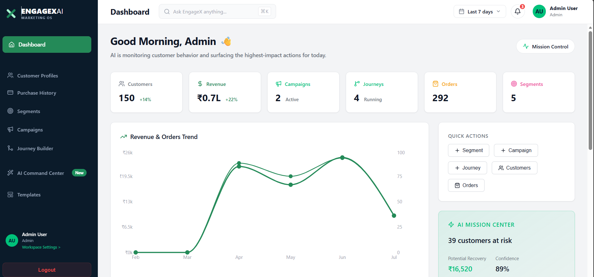
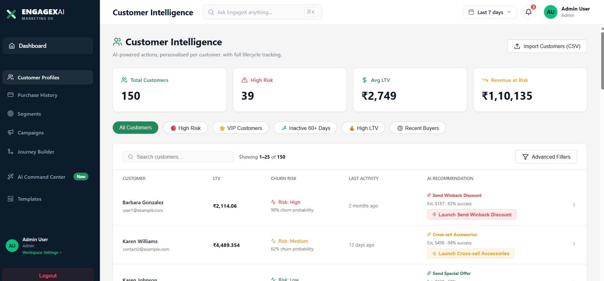
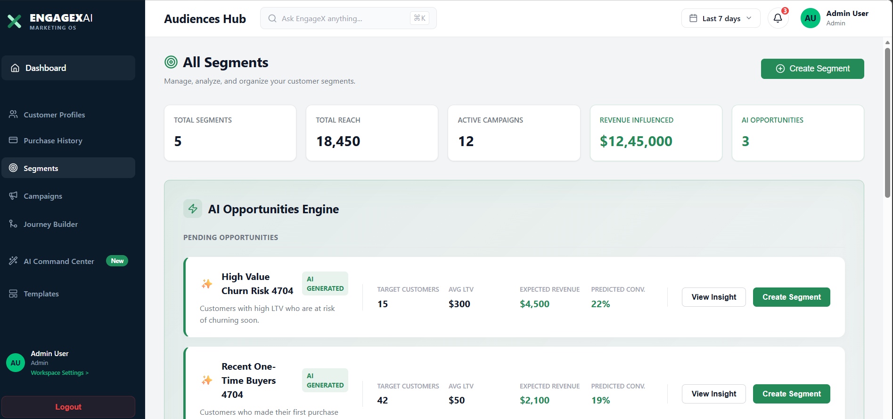
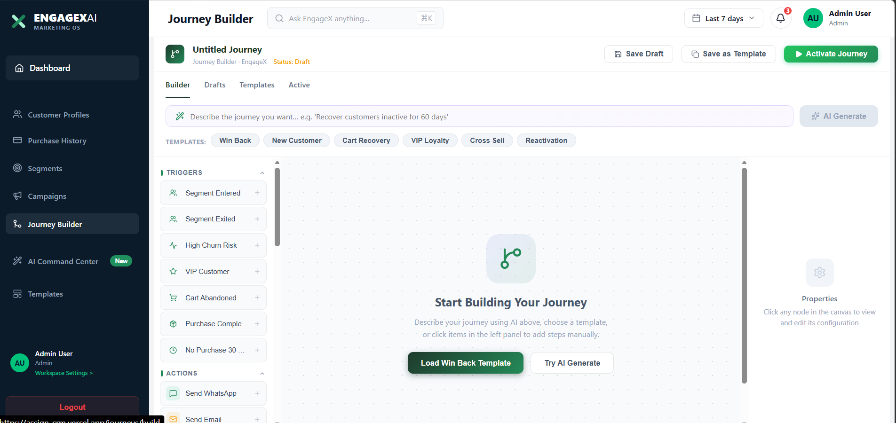
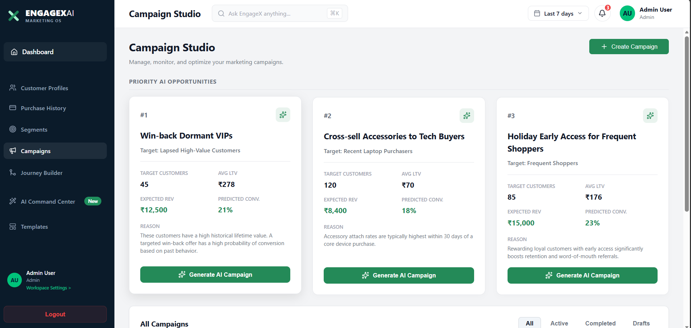
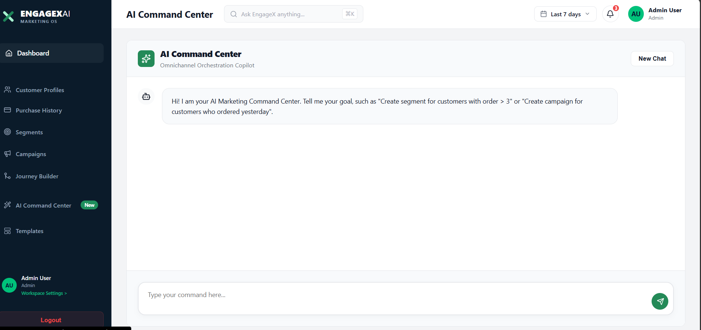

<div align="center">

# EngageX AI CRM 🚀

**An AI-powered multi-tenant CRM and Marketing Automation platform for modern businesses.**

[](https://assign-crm.vercel.app/)
[](#)
[](#)


</div>

## 📖 Project Overview

EngageX AI CRM is a comprehensive, multi-tenant Customer Relationship Management (CRM) and Marketing Automation platform designed for modern, data-driven businesses. 

**What problem it solves:**
Traditional CRMs are often static databases that require manual labor to extract insights or execute campaigns. EngageX bridges the gap by natively embedding Artificial Intelligence at every layer—from predicting customer churn to autonomously generating cross-channel marketing journeys and hyper-personalized message templates.

**Who it is built for:**
Marketing teams, growth engineers, and business operators who need an enterprise-grade platform to visualize audience data, build complex automation workflows, and drive engagement without heavy reliance on data science teams.

**Main business value:**
By consolidating customer data, audience segmentation, campaign orchestration, and AI-driven predictive insights into a single multi-tenant platform, EngageX significantly reduces time-to-market for campaigns, improves conversion rates, and reduces customer churn.

---

## ✨ Features

### 🔐 Authentication & Multi-Tenant Workspace
- Secure JWT-based authentication.
- Full multi-tenant isolation, ensuring data privacy across different organizational workspaces.
- Role-based access control (RBAC).

### 👥 Customer Management
- Unified customer profiles tracking lifetime value, behavioral scores, and order history.
- High-performance, searchable and sortable customer grids.
- Import/Export tooling for customer and order datasets.

### 🎯 Audience Segmentation
- Advanced filtering engine to build dynamic, real-time audience segments.
- AI-generated audience segment suggestions based on purchasing behavior.
- Real-time audience sizing and potential revenue estimations.

### 📢 Campaign Management
- End-to-end Campaign Studio for designing, tracking, and optimizing multi-channel campaigns.
- Visual status tracking (Draft, Active, Paused, Completed).

### 🛤️ Journey Builder
- Visual drag-and-drop workflow canvas for designing complex marketing automations.
- Nodes for Triggers, Actions (Email, SMS, WhatsApp), Logic (Waits, Conditions), and AI tasks.
- Live, node-by-node analytics and simulated state execution.

### 🧠 AI Command Center
- **AI Insights:** Predictive analytics for customer churn, product recommendations, and best-offer calculations.
- **Generative AI:** Automatic campaign message generation and template rewriting.
- **Next-Best Action:** AI-driven strategic recommendations for active campaigns.

### 📊 Analytics Dashboard
- Comprehensive reporting on key metrics: Total Customers, Revenue, Open Rates, and Conversion Rates.
- Visual charts and breakdowns of channel performance and audience health.

### 📝 Templates & Settings
- HTML and text template management for reusable communication across journeys.
- Workspace-level settings and configuration.

---

## 💻 Tech Stack

| Category | Technologies |
| --- | --- |
| **Frontend** | React, TypeScript, Vite, React Router, CSS Modules, Lucide Icons |
| **Backend** | Python, Flask, Flask-RESTful, Flask-JWT-Extended, SQLAlchemy |
| **Database** | PostgreSQL, SQLite (Dev) |
| **AI / ML** | Google Gemini AI API |
| **Architecture** | REST API, App-Factory Pattern, Multi-Tenant Architecture |

---

## 📸 Screenshots

| Dashboard | Customer Management |
| :---: | :---: |
|  |  |

| Audience Builder | Journey Canvas |
| :---: | :---: |
|  |  |

| Campaign Studio | AI Command Center |
| :---: | :---: |
|  |  |

---

## 🚀 Quick Start

### 1. Clone Repository
```bash
git clone https://github.com/yourusername/engagex-ai-crm.git
cd engagex-ai-crm
```

### 2. Environment Setup
Create a `.env` file in the `backend/` directory. Refer to the [Environment Variables](#-environment-variables) section below for required keys.

### 3. Backend Setup
```bash
cd backend
python -m venv .venv

# Windows
.venv\Scripts\activate
# Mac/Linux
source .venv/bin/activate

pip install -r requirements.txt

# Initialize the database
flask db upgrade
```

### 4. Run Backend
```bash
python run.py
```
*The API will run on http://localhost:5000*

### 5. Frontend Setup
Open a new terminal.
```bash
cd frontend
npm install
```

### 6. Run Frontend
```bash
npm run dev
```
*The web application will run on http://localhost:5173*

---

## 🔐 Environment Variables

Ensure you have a `.env` file located in `backend/`.

| Variable | Description | Default / Example |
| --- | --- | --- |
| `FLASK_ENV` | Application environment state | `development` |
| `SECRET_KEY` | Secret key for Flask application sessions | `your_secret_key_here` |
| `JWT_SECRET_KEY` | Secret key used for encoding JWT tokens | `your_jwt_secret_key_here` |
| `DATABASE_URL` | Connection string for PostgreSQL / SQLite | `sqlite:///app.db` |
| `GEMINI_API_KEY` | API key for Google's Gemini AI integration | `AIzaSy...` |

---

## 📁 Project Structure

```text
engagex-ai-crm/
├── backend/                  # Flask REST API
│   ├── app/                  # Application Factory
│   │   ├── models/           # SQLAlchemy Database Models
│   │   ├── routes/           # API Blueprint Controllers
│   │   └── services/         # Business logic & AI wrappers
│   ├── migrations/           # Alembic Database Migrations
│   ├── run.py                # Backend entry point
│   └── requirements.txt      # Python dependencies
├── frontend/                 # React SPA
│   ├── src/                  
│   │   ├── components/       # Reusable UI components & Pages
│   │   ├── App.tsx           # React Router setup
│   │   ├── index.css         # Global styles & CSS variables
│   │   └── config.ts         # Environment configurations
│   ├── package.json          # Node dependencies
│   └── vite.config.ts        # Vite bundler configuration
└── README.md                 # Project Documentation
```

---

## 🏗 Architecture

EngageX AI CRM utilizes a decoupled, modernized web architecture:
- **Backend:** Designed using the Flask App-Factory pattern, exposing strict RESTful JSON endpoints. It handles heavy data operations, synchronous multi-threaded journey simulations, and secure database interactions via SQLAlchemy.
- **Frontend:** A React Single Page Application utilizing a global state structure mapped tightly to the REST API, resulting in a highly responsive and state-driven UI.
- **AI Layer:** The AI logic is abstracted into service layers, calling the Gemini API to analyze CRM data, return predictive scores, and generate JSON-structured insights.

*Detailed architectural diagrams and component hierarchies are available in `docs/architecture.md` (Coming Soon).*

---

## 🧪 Testing

### Backend Tests
```bash
cd backend
python -m pytest
```

### Frontend Tests
```bash
cd frontend
npm run test
```

---

## 🗺️ Roadmap

- [x] Multi-Tenant Architecture & JWT Auth
- [x] High-Fidelity UI Design System
- [x] Dynamic Audience Builder
- [x] Live Journey Builder (Triggers, Conditions, Waits, Actions)
- [x] Integration with Gemini AI
- [ ] Real-time WebSocket support for Journey Analytics
- [ ] Direct Integrations with Twilio & SendGrid
- [ ] Native Mobile Application
- [ ] Enterprise SSO (SAML/OAuth)

---

## 🚀 Deployment

### Local Development
Follow the [Quick Start](#-quick-start) guide above.

### Production
- **Frontend:** Build static files using `npm run build`. Serve via Vercel, Netlify, or NGINX.
- **Backend:** Serve the WSGI application using Gunicorn or uWSGI behind an NGINX reverse proxy.
- **Database:** Provision a managed PostgreSQL instance (e.g., AWS RDS, Supabase) and update the `DATABASE_URL` environment variable.

---

## 🔑 Demo Credentials

To test the application locally without creating a new workspace, you can use the seeded demo accounts:

**Admin User**
- **Email:** `admin@xeno.ai`
- **Password:** `admin123`

*Note: Ensure you have run the data seeding script (`python seed.py`) if setting up a fresh database.*

---

## 🤝 Contributing

Contributions are what make the open-source community such an amazing place to learn, inspire, and create. Any contributions you make are **greatly appreciated**.

1. Fork the Project
2. Create your Feature Branch (`git checkout -b feature/AmazingFeature`)
3. Commit your Changes (`git commit -m 'Add some AmazingFeature'`)
4. Push to the Branch (`git push origin feature/AmazingFeature`)
5. Open a Pull Request

---

## 📄 License

Distributed under the MIT License. See `LICENSE` for more information.

---

## ✍️ Author

**Digital Heroes Full Stack Developer Trial**

Built with ❤️ for modern marketing teams.
