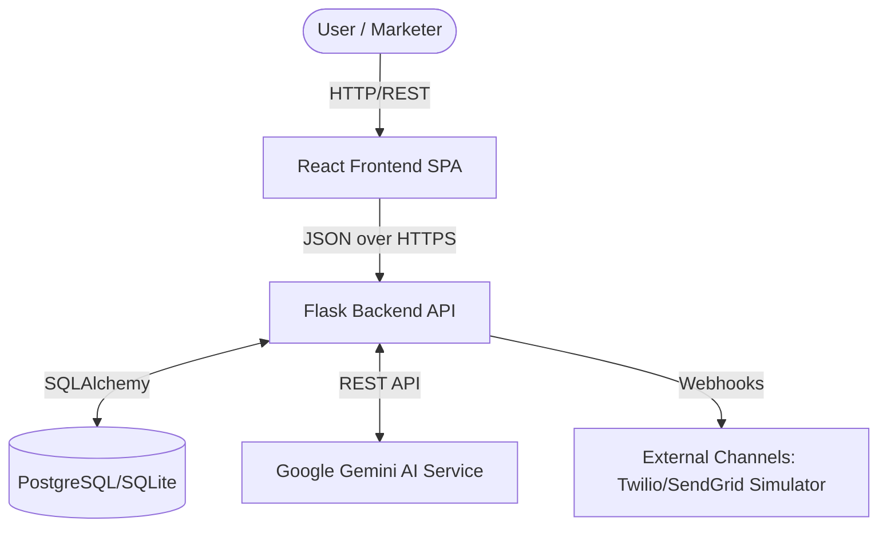
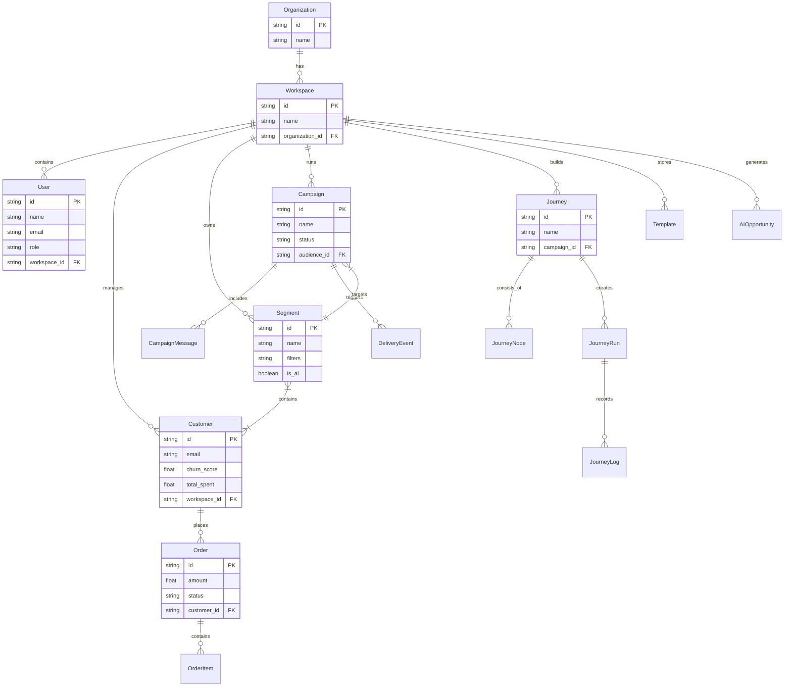
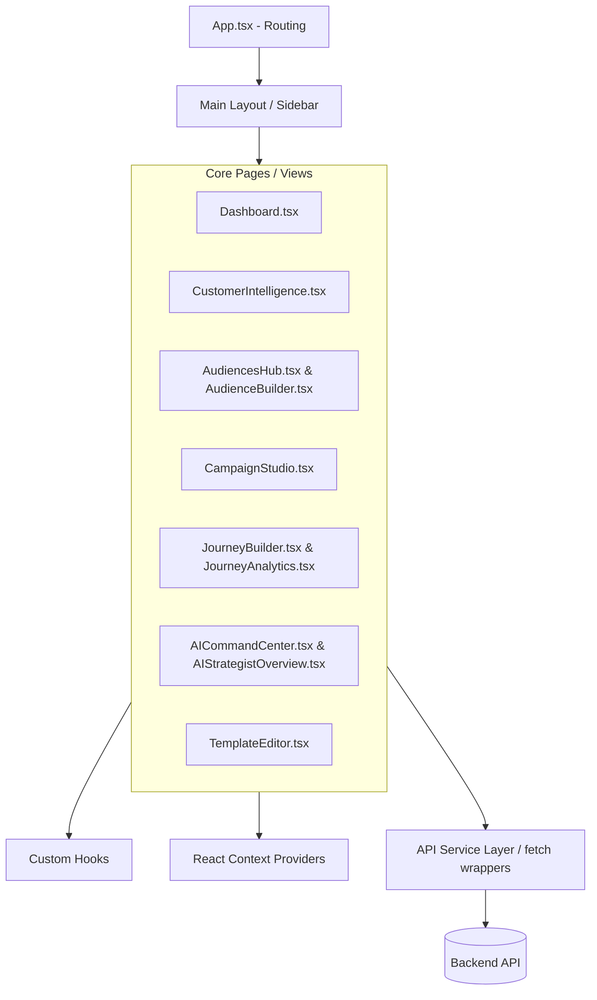
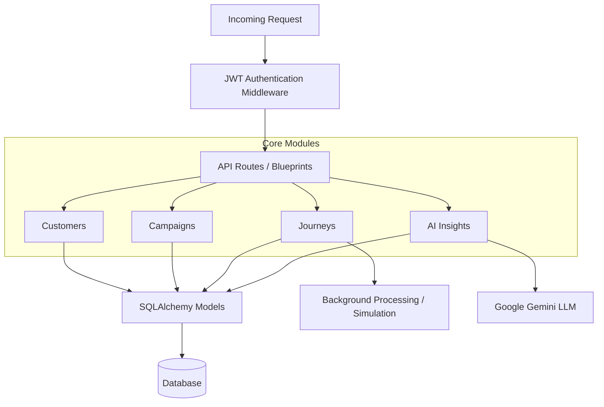
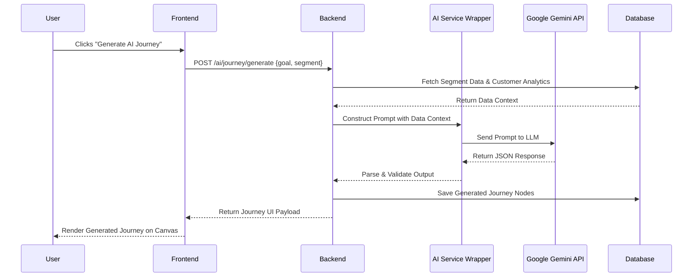
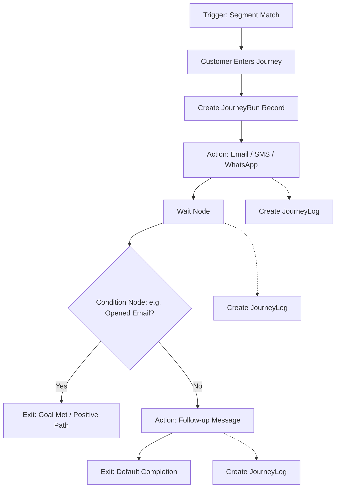

# EngageX AI CRM - Architecture Documentation

## 1. System Architecture
This diagram outlines the high-level system architecture, showing how the frontend, backend, database, and external AI services interact.

## 2. Database ER Diagram
This diagram represents the core data models and their relationships within the multi-tenant architecture.

## 3. Frontend Architecture
The frontend is a React Single Page Application (SPA) structured around feature-based components and pages.

## 4. Backend Architecture
The backend uses a modular App-Factory pattern with Flask, keeping routes, models, and AI logic separated.

## 5. AI Flow
How AI insights and content generations are processed throughout the platform.

## 6. Journey Builder Flow
The execution flow of a customer passing through an active marketing journey automation.

